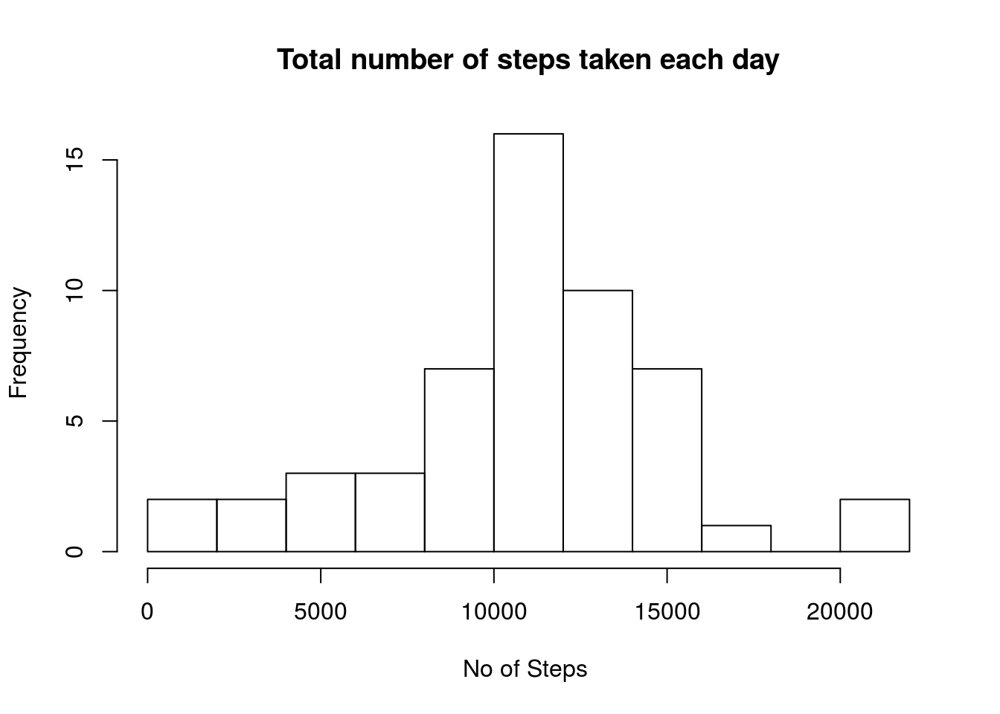
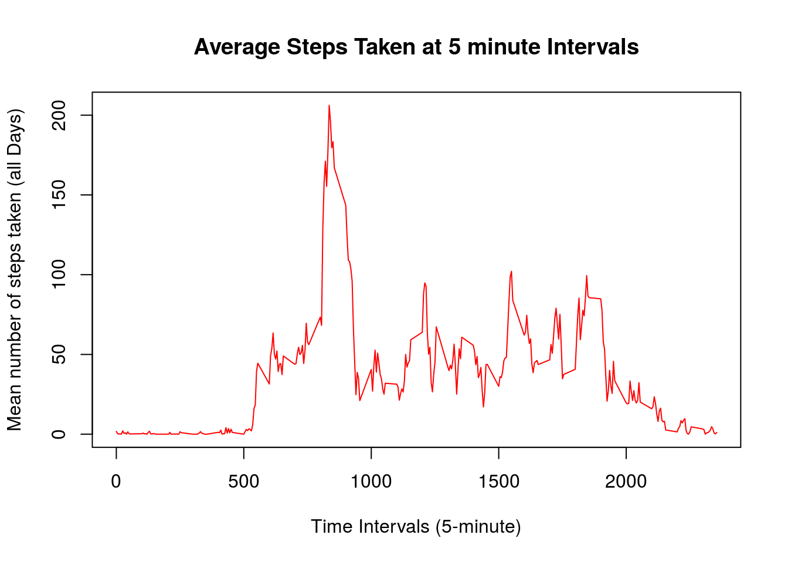
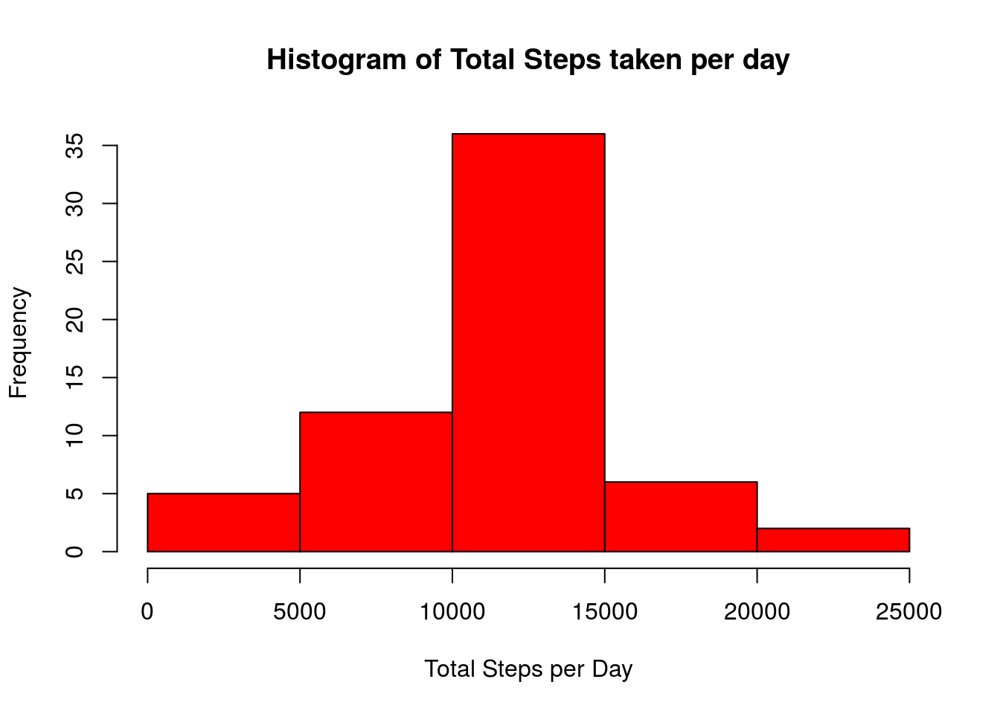
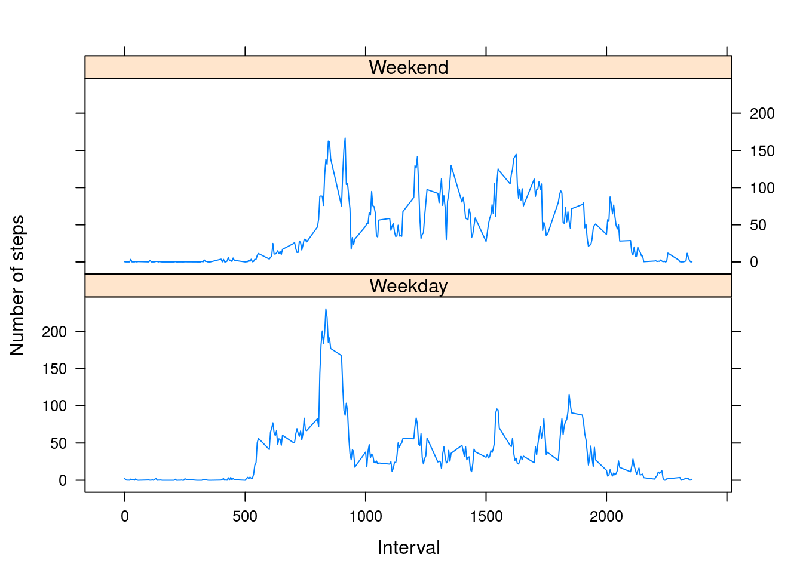

Loading and preprocessing the data
----------------------------------

    unzip(zipfile="activity.zip")
    data <- read.csv("activity.csv")
    str(data)

    ## 'data.frame':    17568 obs. of  3 variables:
    ##  $ steps   : int  NA NA NA NA NA NA NA NA NA NA ...
    ##  $ date    : Factor w/ 61 levels "2012-10-01","2012-10-02",..: 1 1 1 1 1 1 1 1 1 1 ...
    ##  $ interval: int  0 5 10 15 20 25 30 35 40 45 ...

What is mean total number of steps taken per day?
-------------------------------------------------

    #library(ggplot2)
    #TotalSteps <- tapply(data$steps, data$date, FUN=sum, na.rm=TRUE)
    TotalSteps <- aggregate(steps ~ date, data = data, sum)
    #qplot(total.steps, binwidth=2000, xlab="Total number of steps taken each day",)
    hist(TotalSteps$steps,breaks = 10, main = "Total number of steps taken each day", xlab = "No of Steps ")

    Mn <- floor(mean(TotalSteps$steps, na.rm=TRUE)) # 3
    Md <- median(TotalSteps$steps, na.rm=TRUE) # 3

Mean of the total number of steps taken per day = 1.076610^{4}

Median of the total number of steps taken per day = 10765

What is the average daily activity pattern?
-------------------------------------------

1.  Split data by intervals.
2.  Calculate average of steps in each 5 minutes interval.
3.  Plot 5-minute interval (x-axis) and the average number of steps
    taken, averaged across all days (y-axis).
4.  Find the interval that contain maximum number of steps.

<!-- -->

    library(ggplot2)
    meansteps <- tapply(data$steps,data$interval,mean,na.rm=TRUE)

    plot(row.names(meansteps),meansteps,type="l",
         xlab="Time Intervals (5-minute)", 
         ylab="Mean number of steps taken (all Days)", 
         main="Average Steps Taken at 5 minute Intervals",
         col="red")

Find the time interval that contains maximum average number of steps
over all days

    interval_num <- which.max(meansteps)
    interval_max_steps <- names(interval_num)

The 835th minute or 104th 5 minute interval contains the maximum number
of steps on average across all the days

Imputing missing values
-----------------------

1.  Calculate and report the total number of missing values in
    the dataset.
2.  Devise a strategy for filling in all of the missing values in
    the dataset.
3.  Create a new dataset that is equal to the original dataset but with
    the missing data filled
4.  Make a histogram of the total number of steps taken each day and
    Calculate and report the mean and median total number of steps taken
    per day.

<!-- -->

    num_na_values <- sum(is.na(data))

Total number of missing values in the dataset are 2304

Fill in missing values using the **average interval value across all
days**

    na_indices <-  which(is.na(data))
    imputed_values <- meansteps[as.character(data[na_indices,3])]
    names(imputed_values) <- na_indices
    for (i in na_indices) {
        data$steps[i] = imputed_values[as.character(i)]
    }

Total number of missing values in the dataset after filling are 0

    totsteps <- tapply(data$steps, data$date,sum)
    hist(totsteps,col="red",xlab="Total Steps per Day", 
          ylab="Frequency", main="Histogram of Total Steps taken per day")

New Mean of the total number of steps taken per day = 1.076710^{4}\`

New Median of the total number of steps taken per day = 1.076710^{4}

Are there differences in activity patterns between weekdays and weekends?
-------------------------------------------------------------------------

1.  Create a new factor variable in the dataset with two levels –
    “weekday” and “weekend” indicating whether a given date is a weekday
    or weekend day.
2.  Make a panel plot containing a time series plot (i.e. type = "l") of
    the 5-minute interval (x-axis) and the average number of steps
    taken, averaged across all weekday days or weekend days (y-axis).

<!-- -->

    data$date <- as.Date(data$date,"%Y-%m-%d")
    days <- weekdays(data$date)

    data$day_type <- ifelse(days == "Saturday" | days == "Sunday", "Weekend", "Weekday")
    meansteps <- aggregate(data$steps, by=list(data$interval, data$day_type),mean)
    names(meansteps) <- c("interval","day_type","steps")
    library(lattice)
    xyplot(steps~interval | day_type, meansteps,type="l",
           layout=c(1,2),xlab="Interval",ylab = "Number of steps")

 There is a more activity during
week-end time.
